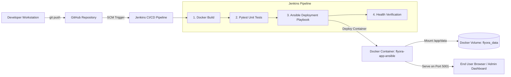

# ✈️ Flyora – Cloud-Native Flight Booking System with DevOps CI/CD

> **Course**: 23IT723 – DevOps Laboratory  
> **Institution**: Coimbatore Institute of Technology (CIT)  
> **Architecture Flow**: `GitHub` ➔ `Jenkins CI/CD` ➔ `Docker Build` ➔ `Pytest Automation` ➔ `Ansible Deployment` ➔ `Docker Volume (Persistent Storage)` ➔ `Flask Backend` ➔ `SQLite Database`

---

## 📌 Project Overview
**Flyora** is a cloud-native, modern flight booking platform tailored for Indian domestic & international routes with real-time Indian Rupee (₹) transactions, DigiYatra-ready boarding passes, interactive seat maps, and an administrative portal.

The project integrates end-to-end DevOps practices:
- **Version Control & Collaboration**: Git & GitHub
- **Containerization**: Docker (Multi-layer lightweight Python container)
- **Continuous Integration / Continuous Deployment**: Jenkins Declarative Pipeline
- **Automated Testing**: Pytest unit & integration test suites
- **Configuration Management & Deployment**: Ansible Playbook (`community.docker`)
- **Persistent Storage**: Docker Volumes (`flyora_data:/app/data`) for SQLite retention

---

## 🛠️ Technology Stack
| Layer | Technology | Purpose |
| :--- | :--- | :--- |
| **Frontend** | HTML5, CSS3, JavaScript (ES6+) | Interactive flight booking UI, seat selection, UPI payment simulation |
| **Backend** | Python 3.11 / Flask 3.x | REST API endpoints, routing, and booking engine |
| **Database** | SQLite 3 (`data/flights.db`) | Persistent passenger bookings & manifest data |
| **Version Control** | Git & GitHub | SCM & release tracking |
| **CI/CD** | Jenkins 2.x | Automated build, test, and deployment pipeline |
| **Containerization** | Docker | Application isolation and portable runtime environment |
| **Testing** | Pytest 8.x | Automated functional API & health testing |
| **Configuration Mgmt** | Ansible 2.x | Repeatable container deployment & volume mounting |

---

## 🏗️ DevOps Pipeline Architecture



---

## 🚀 Quick Start Guide

### 1. Local Development Execution
```bash
# Install Python dependencies
pip install -r requirements.txt

# Run automated tests
pytest test_app.py -v

# Start Flask backend server
python app.py
```
Open **http://localhost:5000** in your web browser.

---

### 2. Docker Containerization Commands
```bash
# Build Docker image
docker build -t flyora-flight-booking-ci .

# Run automated tests inside container
docker run --rm flyora-flight-booking-ci python -m pytest test_app.py -v

# Run container with persistent Docker volume
docker volume create flyora_data
docker run -d --name flyora-app-ansible -p 5001:5000 -v flyora_data:/app/data --restart always flyora-flight-booking-ci
```
Access the application on **http://localhost:5001** and Admin Portal on **http://localhost:5001/admin**.

---

### 3. Ansible Automated Deployment
```bash
# Run Ansible playbook locally or via lab container
ansible-playbook -i inventory.ini docker-deploy.yml

# Or from the ansible-docker-lab container:
docker exec ansible-docker-lab ansible-playbook -i /inventory.ini /docker-deploy.yml
```

---

### 4. Database & Volume Verification
```bash
# List persistent Docker volumes
docker volume ls

# Inspect volume
docker volume inspect flyora_data

# Query SQLite database records inside container
docker exec flyora-app-ansible python -c "import sqlite3; c=sqlite3.connect('data/flights.db'); print(c.execute('SELECT * FROM bookings').fetchall()); c.close()"
```

---

## 📂 Project Structure
```
├── app.py                  # Flask Backend & REST API
├── app.js                  # Frontend Logic & UI Controller
├── index.html              # Modern Indian Flight Booking UI
├── styles.css              # Rich CSS Stylesheet & Glassmorphism Design
├── test_app.py             # Pytest Automated Test Suite
├── Dockerfile              # Docker Container Definition
├── docker-deploy.yml       # Ansible Deployment Playbook
├── inventory.ini           # Ansible Inventory Config
├── Jenkinsfile             # Jenkins Declarative Pipeline Script
├── requirements.txt        # Python Dependencies
├── .gitignore              # Git Ignore Rules
└── README.md               # Project Documentation
```
